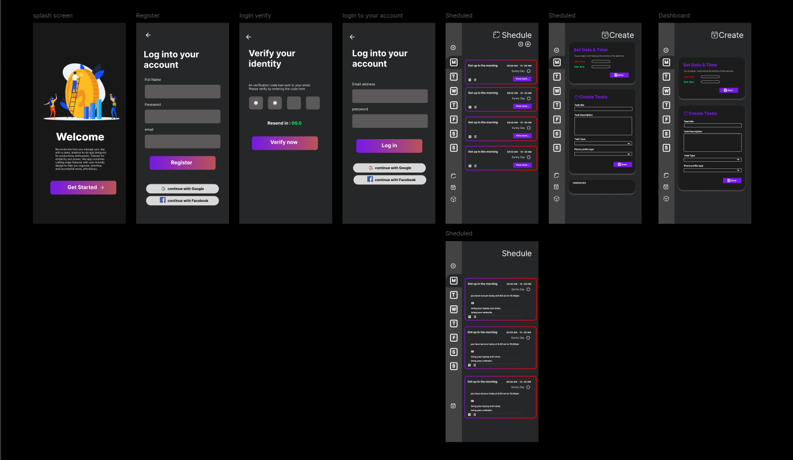

# letsdo

A new Flutter project.

## Getting Started

[](https://pub.dev/packages/flutter)
[](https://pub.dev/packages/cupertino_icons)
[](https://pub.dev/packages/get)
[](https://pub.dev/packages/flutter_test)
[](https://pub.dev/packages/flutter_lints)



### fork project to your Github Repo 

```http
https://github.com/ZeroWillHero/Lets-do.git
```

### clone the repository
clone the project from your repository.
```bash
git clone {your repo link}
```
